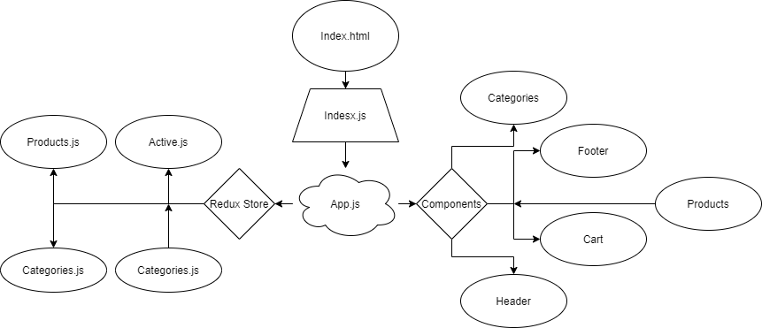

# Store Front &middot;

An e-Commerce storefront using React with Redux, coupled with your live API server

## Tests & Deployment

[Preview]()

## Available Scripts

In the project directory, you can run:

### `yarn start`

Runs the app in the development mode.

### `yarn test`

Launches the test runner in the interactive watch mode.

### `yarn build`

Builds the app for production to the `build` folder.

## Files Structure

```bash
.
├── LICENSE
├── README.md
├── assets
│   └── storefront.png
├── package.json
├── public
│   └── index.html
├── src
│   ├── App.js
│   ├── components
│   │   ├── Categories.js
│   │   ├── Footer.js
│   │   ├── Header.js
│   │   └── Products.js
│   ├── index.css
│   ├── index.js
│   └── provider
│       ├── actions
│       │   └── Active.js
│       ├── categories-reducer.js
│       ├── products-reducer.js
│       └── store.js
└── yarn.lock
```

## UML Diagram


